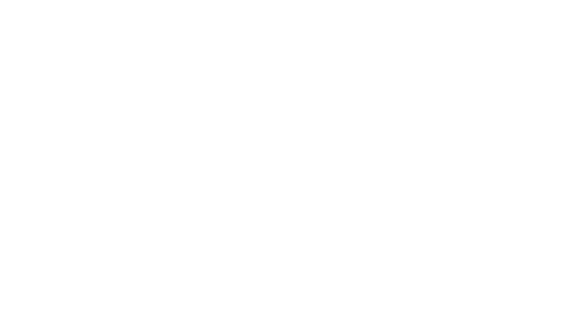
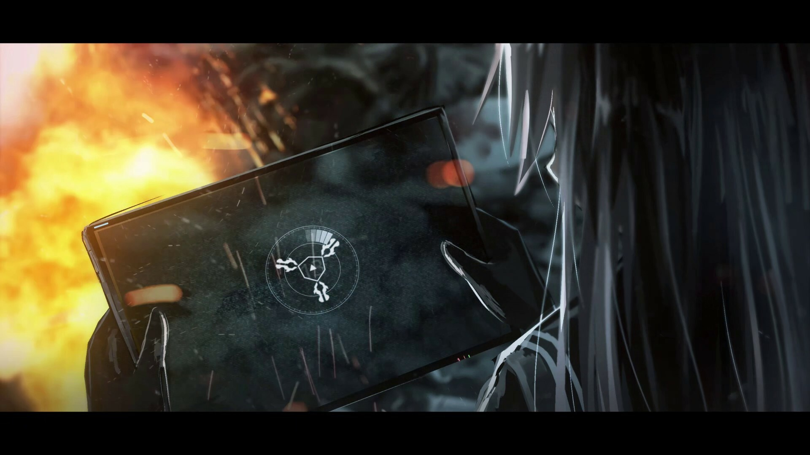

# Mobius Band*

《Mobius Band*》是一款中篇视觉小说游戏。 在那样的时代中，每个人都无力他顾，失去的只能沉寂在心底，仿徨和挣扎是大部分人的缩影，遥望未来本身即一种奢求，苟全于当下已是力竭，繁华文明的皮囊下是名副其实的地狱。 尚未平息的战火纷争中，攥着稻草的他们，最后会如何选择呢——

## 游戏介绍

随着第三次世界大战戏剧性的结束，量子技术的实验性应用，人类开始步入崭新的工业革命，被称为量子变革的时代，同时也开始新冷战时代。由多国合并而成的CES成为了第一大国,却掩盖不了因科技快速发展、贫富差距拉大与宗教问题所带来的高犯罪率。政府在市民身体中埋入芯片，用来监视犯罪行动。

那些被抓捕的嫌犯及他国间谍将被宣告单方面的审判，由法院的执行者带去死亡。希望起到震慑作用的政府将整个处刑活动全程直播，但随着时间的推移，民众似乎渐渐将其当作一种娱乐节目来看待。

2054年，弗兰克联邦共和国的菲利雅·冯克里斯蒂安来访期间，军部特殊机构培养的中士丽丽亚·赛特被安排到了伊扎克所属的独立部队第三小队，执行保护菲利雅的任务。然而因为任务中的一个意外， 丽丽娅·赛特开始对自身的存在产生了疑惑....

## 配音成员

丽丽娅：闲踏梧桐

菲利娅：荻秋

基利尔：Emiya

赛里斯：以媛

墨威·菲尔：李享

威廉·菲尔：克雷

莫莉&爱奈：w小璃

## 制作组成员

主催：月

画师：Haguruma-C、废人、Mimimidori、Yusia、龙藏寺兔

剧本&演出：废人、Defisym

程序：Defisym、早川雪乃

音乐&音效：音乐圣殿打酱油、黑耀、橙子miu、麋鹿Studio、魔王魂、仪式用傀儡3702、アリス、泓mizuhiro

语音剪辑&插入：幻空时、月、Defisym

网页：Sola

动态演出&UI：橙子

美工：粒子

## 游戏交流反馈

QQ群：73580810
